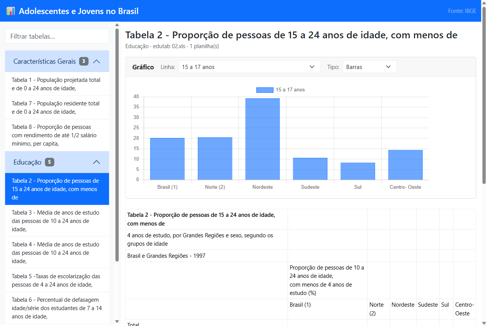

# Adolescentes e Jovens no Brasil, dashboard (IBGE)



Aplicação Node.js/Express que transforma as **22 planilhas `.xls` do IBGE sobre
adolescentes e jovens (10 a 24 anos)** em um dashboard navegável: o servidor lê
e converte todas as planilhas em JSON na inicialização, e o front-end (Bootstrap
+ Chart.js) lista as tabelas por categoria, exibe cada uma como tabela HTML e
gera **gráficos** dinamicamente.

## Funcionalidades

- Menu por categoria: **Características Gerais, Educação, Saúde, Trabalho, PeNSE**.
- Cada tabela renderizada como HTML, preservando título e rodapé/fonte.
- **Gráfico automático** (barras ou linha) de qualquer linha numérica da tabela —
  ex.: "menos de 4 anos de estudo" por Grande Região.
- Busca/filtro de tabelas pelo título.
- Conversão de Excel feita uma vez na inicialização e mantida em memória.

## Como funciona

```
.xls (22 arquivos) ──► app.js (convert-excel-to-json ► matriz 2D) ──► API JSON ──► front-end
```

- `GET /api/catalog` — lista de tabelas (id, categoria, título).
- `GET /api/tables/:id` — dados completos de uma tabela (planilhas em matriz 2D).

O front-end ([public/main.js](./public/main.js)) detecta automaticamente a linha
de cabeçalho e as linhas numéricas de cada planilha para montar o gráfico, sem
configuração por tabela.

## Fonte dos dados

Tabelas estatísticas do **IBGE**:

- **PNAD 1997** — *Pesquisa Nacional por Amostra de Domicílios 1997, Microdados*
  (Rio de Janeiro: IBGE, 1998) — base das tabelas de Características Gerais,
  Educação, Saúde e Trabalho (a citação aparece no rodapé de cada planilha).
- **PeNSE** — *Pesquisa Nacional de Saúde do Escolar* (2009–2019), arquivo
  `PeNSE/Guia_Tabelas_PeNSE_2009_2019_9ano.xls`.

Os arquivos `.xls` estão organizados por tema nas pastas
`Caracteristicas_Gerais/`, `Educacao/`, `Saude/`, `Trabalho/` e `PeNSE/`.

## Como executar

```bash
npm install
npm start
```

O servidor sobe em `http://localhost:3000`.

## Stack

- **Back-end:** Node.js, Express, `convert-excel-to-json`
- **Front-end:** Bootstrap 5, Chart.js
