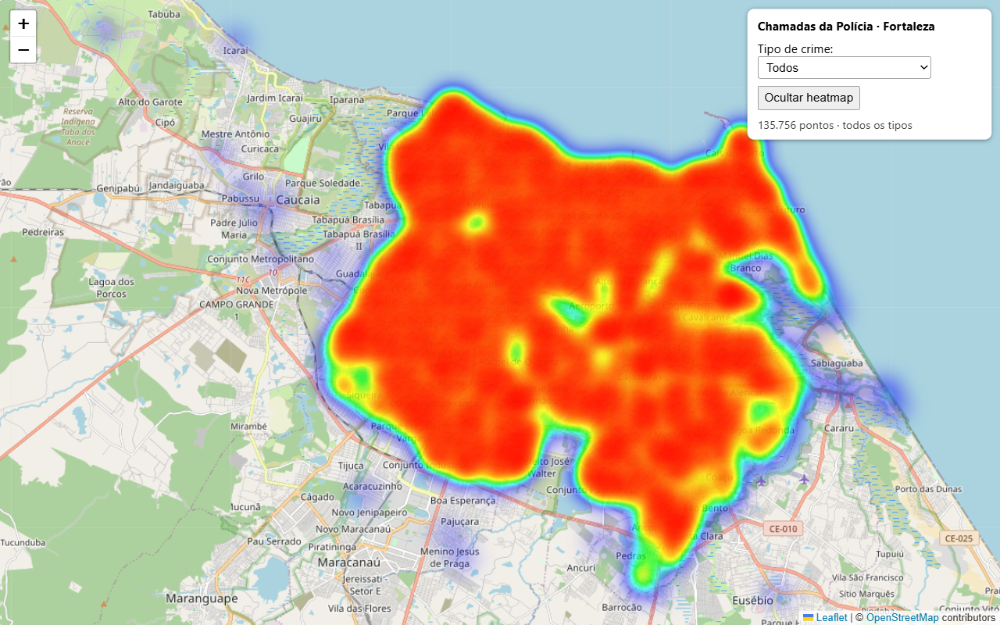

# Mapa de calor — Chamadas da Polícia (Fortaleza)



Aplicação Node.js/Express que gera um **mapa de calor (heatmap)** das chamadas da
polícia em Fortaleza, renderizado com **[Leaflet](https://leafletjs.com) +
[Leaflet.heat](https://github.com/Leaflet/Leaflet.heat)** sobre tiles do
**OpenStreetMap** — sem necessidade de chave de API.

O servidor lê [`policecalls.csv`](./policecalls.csv) uma vez na inicialização,
mantém os pontos em memória e os expõe como JSON em `GET /api/policecalls`. O
front-end ([public/map.js](./public/map.js)) busca esses pontos e monta a camada
de calor, com **filtro por tipo de crime** e enquadramento automático na cidade.

## Funcionalidades

- Mapa de calor de ~135 mil ocorrências sobre Fortaleza.
- Filtro por tipo: **Todos / PROPERTY CRIMES / DISTURBING THE PEACE**.
- Botão para mostrar/ocultar o heatmap.
- Descarte automático de coordenadas inválidas (outliers fora de Fortaleza).

## Fonte dos dados

Os dados **não são gerados pela aplicação** — eles vêm do portal de
**Dados Abertos da Prefeitura de Fortaleza**:

| | |
|---|---|
| **Portal** | [dados.fortaleza.ce.gov.br](https://dados.fortaleza.ce.gov.br) (CKAN) |
| **Conjunto de dados** | [Chamadas da Polícia](https://dados.fortaleza.ce.gov.br/dataset/chamadas_policia) |
| **Órgão publicador** | CITINOVA — Fundação de Ciência, Tecnologia e Inovação de Fortaleza |
| **Arquivo** | `policecalls.csv` |
| **Download direto** | https://dados.fortaleza.ce.gov.br/dataset/5fd98aaa-1e16-425a-9e42-2c580d5d156c/resource/e65d44e1-8cc4-4dd4-addc-eee741845c94/download/policecalls.csv |

### Estrutura do CSV

Colunas: `date, type, lat, lng` — 135.760 registros, período **2005–2007**.
(Na carga, 4 coordenadas inválidas fora de Fortaleza são descartadas.)

| Categoria (`type`) | Registros |
|---|---|
| `PROPERTY CRIMES` | 81.911 |
| `DISTURBING THE PEACE` | 53.849 |

## Como executar

```bash
npm install
npm start
```

O servidor sobe em `http://localhost:3000`.

## Stack

- **Back-end:** Node.js, Express, `csv-parse`
- **Front-end:** Leaflet + Leaflet.heat, tiles do OpenStreetMap
